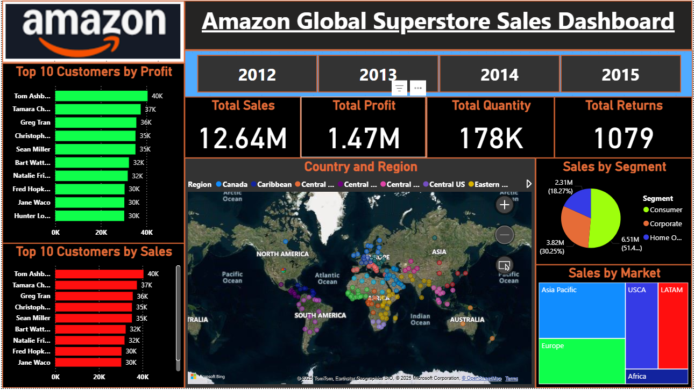

# 📊 Amazon Global Superstore Sales Dashboard  

  

## 📌 Project Overview  
This project presents an **Amazon Global Superstore Sales Dashboard** built in **Power BI**.  
The dashboard provides actionable insights on **sales, profit, returns, and customer performance** across regions, markets, and segments.  

The primary goal of this dashboard is to help business users quickly understand:  
- Revenue and profitability trends  
- Customer contribution  
- Regional and market performance  
- Product and segment distribution  

---

## 🛠️ Tools & Technologies  
- **Power BI Desktop**  
- **MS Excel /** dataset  
- **DAX (Data Analysis Expressions)** for measures  
- **Power Query** for data cleaning and transformations  

---

## 📂 Dataset  
The dataset contains global sales transactions with fields like:  
- `Order ID`  
- `Customer Name`  
- `Region` & `Country`  
- `Market`  
- `Segment`  
- `Sales`  
- `Profit`  
- `Quantity`  
- `Returns`  

---

## 📈 Key Features of Dashboard  

1. **Top KPIs (Cards)**  
   - Total Sales  
   - Total Profit  
   - Total Quantity  
   - Total Returns  

2. **Customer Insights**  
   - Top 10 Customers by Profit  
   - Top 10 Customers by Sales  

3. **Geographic Insights**  
   - Sales distribution by Country and Region (interactive map)  

4. **Category / Segment Analysis**  
   - Sales by Segment (Consumer, Corporate, Home Office)  
   - Sales by Market (Asia Pacific, Europe, USCA, LATAM, Africa)  

---

## 🖼️ Dashboard Preview  

  

---

## 🔑 Key Insights  
- Consumer segment generates the **highest revenue** share.  
- USCA and Europe are the strongest performing markets.  
- Returns volume is relatively low compared to total orders.  
- Top 10 customers contribute significantly to overall profit and sales.  

---
 
